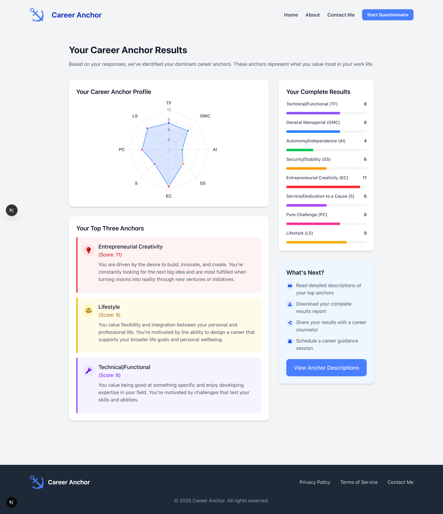

# Career Anchor Assessment Platform

## Overview

The Career Anchor Assessment Platform is a modern web application designed to help individuals discover and understand their core career values and motivations. Based on Edgar Schein's Career Anchors framework from MIT, this tool provides valuable insights into what truly drives your career decisions.



## What Are Career Anchors?

Career anchors are the fundamental values, motivations, and needs that guide your career choices. They represent:

- What you're naturally good at (your skills and competencies)
- What drives you (your motives and needs)
- What matters most to you (your values)

## Key Features

- **Interactive Assessment**: A comprehensive questionnaire to identify your dominant career anchors
- **Visual Results**: Clear visualization of your career anchor profile through radar charts and progress indicators
- **Detailed Insights**: In-depth descriptions of each career anchor and what they mean for your career path
- **Modern Interface**: Clean, intuitive design that makes complex career concepts accessible
- **Mobile-Friendly**: Fully responsive design that works seamlessly on all devices

## The Eight Career Anchors

1. **Technical/Functional Competence**

   - For those who thrive on being experts in their field

2. **General Management**

   - For those who enjoy leading and coordinating diverse functions

3. **Autonomy/Independence**

   - For those who value freedom from organizational constraints

4. **Security/Stability**

   - For those who prioritize predictability and long-term stability

5. **Entrepreneurial Creativity**

   - For those driven to create new ventures or innovations

6. **Service/Dedication to a Cause**

   - For those motivated by making a positive impact

7. **Pure Challenge**

   - For those who thrive on solving complex problems

8. **Lifestyle**
   - For those seeking work-life balance and integration

## Why This Matters

Understanding your career anchors can help you:

- Make better-informed career decisions
- Find roles that align with your core values
- Identify work environments where you'll thrive
- Navigate career transitions more effectively

## Technology Stack

- Next.js 14 (React Framework)
- Tailwind CSS (Styling)
- Radix UI (Accessible Components)
- TypeScript (Type Safety)

## Getting Started

### For Users

Visit [your-deployed-url] to take the assessment and discover your career anchors.

### For Developers

1. Clone the repository:

```bash
git clone [repository-url]
```

2. Install dependencies:

```bash
npm install
```

3. Start the development server:

```bash
npm run dev
```

4. Open [http://localhost:3000](http://localhost:3000) in your browser

## About the Developer

[Your brief introduction and what motivated you to build this project]

## Contact

[Scott Zeta](https://www.linkedin.com/in/scott-zeta/)

## License
